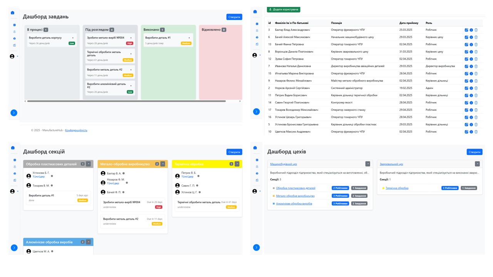

# ManufactureHUB

Hi! It's my handmade  **ASP NET CRM Project** that i've been developing since february 2025 for my university's qualification work of the bachelor. 

in short, this is a hierarchical enterprise management (like Agile) web application with four levels (director, main departments, sites, workplaces) and a monolithic IT architecture of the CRM system, consisting of user interface layers, business logic, database interaction. 

Tech steck C#/.NET, ASP.NET MVC Core, Entity Framework Core, MS SQL Server, Bootstrap, ASP.NET Identity.

